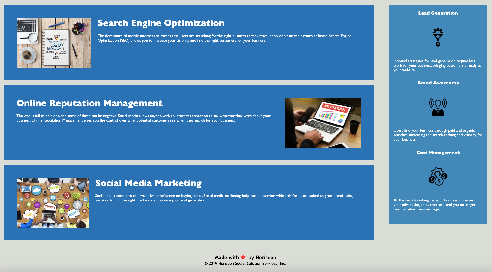

# 01 HTML, CSS, and Git: Code Refactor

* Changed non-semantic elements to semantic elements as well as following accessibility standards so that all users would be able to access and use website.

* Title of Page was changed to company name

* added viewport meta tag

* changed div tags to semantic elements

* Changed Header classes to elements (CSS was updated to reflect these changes)

* alt attribute added to images

* Added aside tag to benefits section 

* 

